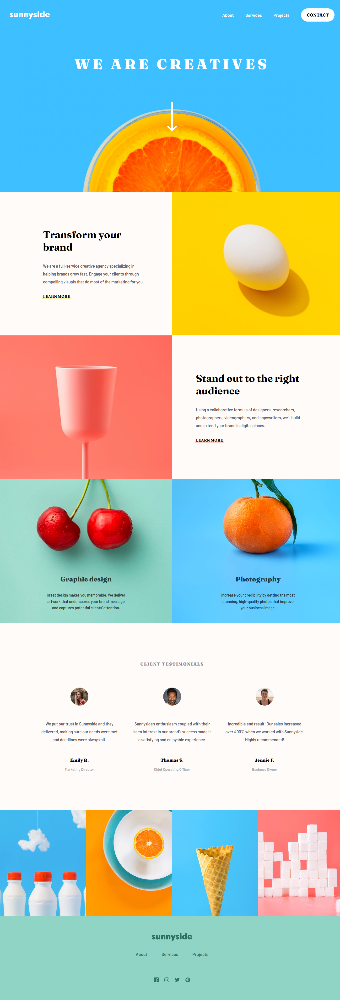

# Frontend Mentor - Sunnyside agency landing page solution

This is a solution to the [Sunnyside agency landing page challenge on Frontend Mentor](https://www.frontendmentor.io/challenges/sunnyside-agency-landing-page-7yVs3B6ef). Frontend Mentor challenges help you improve your coding skills by building realistic projects.

## Table of contents

- [Overview](#overview)
  - [The challenge](#the-challenge)
  - [Screenshot](#screenshot)
  - [Links](#links)
- [My process](#my-process)
  - [Built with](#built-with)
  - [What I learned](#what-i-learned)
  - [Continued development](#continued-development)
- [Author](#author)

## Overview

### The challenge

Users should be able to:

- View the optimal layout for the site depending on their device's screen size
- See hover states for all interactive elements on the page

### Screenshot

### Links

- Solution URL: [https://github.com/wavegate/sunnyside-agency-landing-page-main](https://github.com/wavegate/sunnyside-agency-landing-page-main)
- Live Site URL: [https://symphonious-cajeta-28f9c6.netlify.app/](https://symphonious-cajeta-28f9c6.netlify.app/)

## My process

### Built with

- Semantic HTML5 markup
- CSS custom properties
- Flexbox
- SCSS
- JavaScript

### What I learned

- Quite proud of this one, as it was my first time using SCSS and being able to draw out an entire page layout, albeit a simple one. Took me the better half of a day, but I'd imagine this will get faster over time.
- This is my first time using SCSS. It's been great for organization, especially when dividing the layout into modules and being able to nest media queries into each module.
- You can allow your widths to be responsive using `max-width`.
- The width property is at default the size of the content, but if you do `box-sizing: border-box` then it is set to the size of the border. This helped me understand why my button was the size of the whole row when I was creating an underline using pseudoelements. I was able to set it to the size of the inner text with `width: fit-content`.
- You can set a pseudoelement behind its element by setting the pseudoelement at `z-index:-1` and the element at `z-index:0`.
- Creating a CSS triangle. [This site](https://css-tricks.com/snippets/css/css-triangle/) has a great animation showing how it works.
- Changing the color of a img SVG: https://stackoverflow.com/questions/22252472/how-to-change-the-color-of-an-svg-element
- Taking a screenshot of a full page with Chrome Dev Tools
- More practice with opening and closing dialogs/menus.

### Continued development

- Right now I'm setting heights and widths on everything, which I feel is very inflexible. Instead, I think I should use padding and gap to space things. I think I can choose to manually set heights/widths and use flex-spacing, or I can use padding and place a margin on everything. Seems like a tradeoff between one type of flexibility for another.
- (Never mind, my flex-grow was messing with things, but I'll leave this here as a reminder.) I'm quite confused the difference between `min-width` and `width`. It seems like when I use `height:50%`, it overrides the width, but doesn't override `min-width`. I looked at [This Link](https://dev.to/ziizium/the-difference-between-css-width-min-width-and-max-width-property-49ah), which does a good job at explaining the difference. From what I can tell, setting the width of an image does not necessarily allow it to scale to fill in the container, whereas min-width does.
- I neglected to change from desktop to mobile .jpg files since I was too lazy and all my styling was done already. My guess is that it's better to load smaller files for mobile.

## Author

- Website - [wavegate](https://github.com/wavegate)
- Frontend Mentor - [@wavegate](https://www.frontendmentor.io/profile/wavegate)
